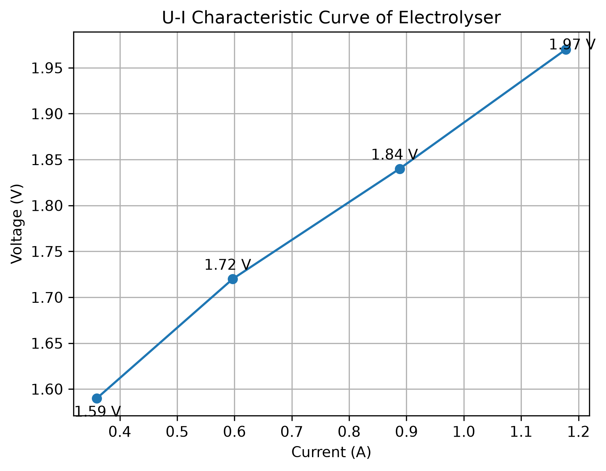
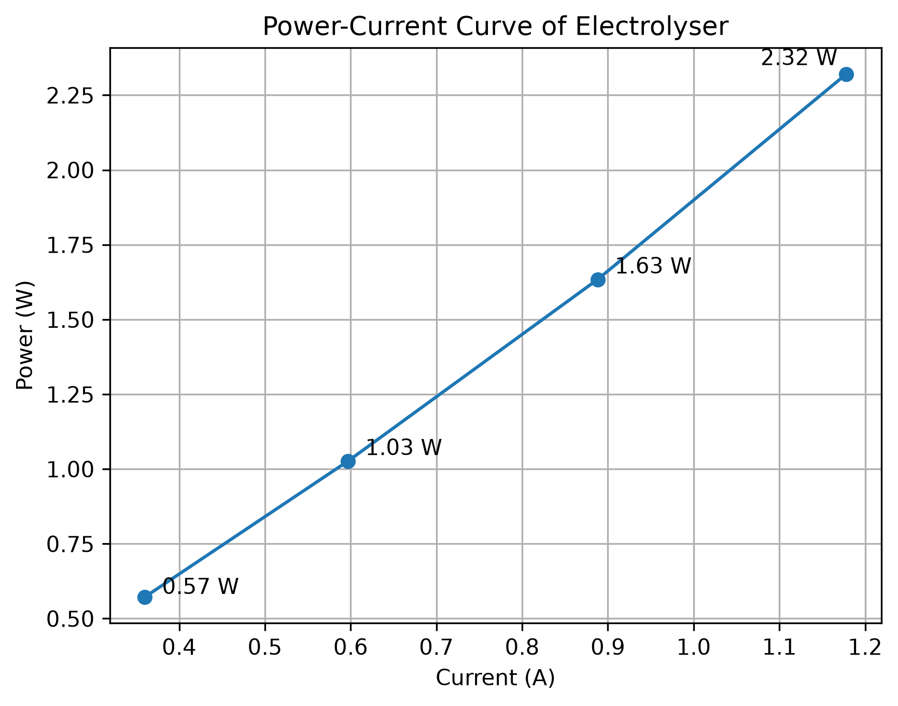
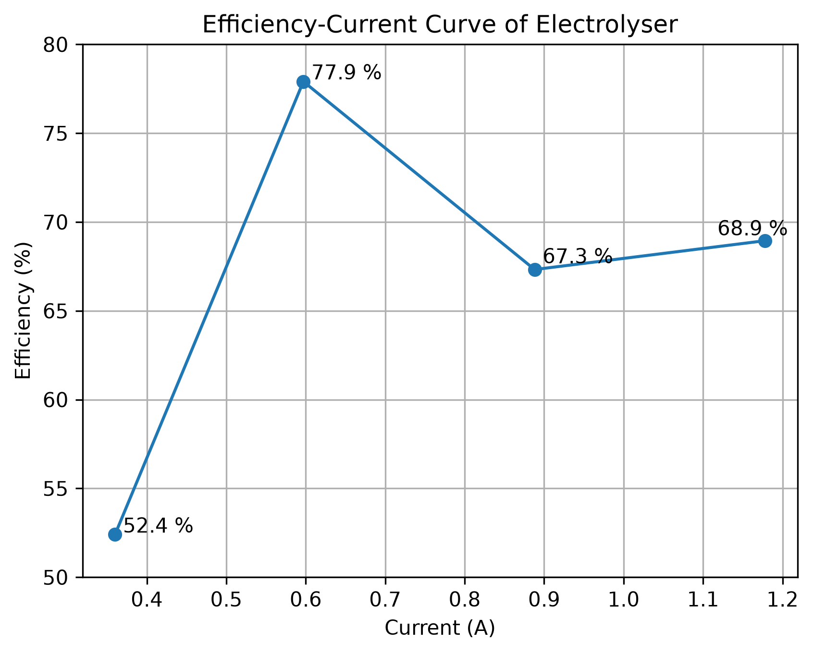

# Hydrogen Electrolyser Data Analysis

## 1. Project Overview

This project analyzes experimental data from a hydrogen electrolyser using Python.

The objective is to process measured voltage, current, time, and hydrogen energy data, calculate key engineering parameters, and visualize the performance of the electrolyser.

The analysis includes:

- Power calculation
- Electrical energy calculation
- Efficiency calculation
- U-I characteristic curve
- Power-current curve
- Efficiency-current curve

This project demonstrates a basic engineering data analysis workflow using CSV data, pandas, and matplotlib.

中文说明：  
这个项目展示了如何使用 Python 处理电解槽实验数据，并将原始实验数据转化为工程计算结果和性能曲线。

---

## 2. Engineering Background

A hydrogen electrolyser converts electrical energy into chemical energy stored in hydrogen.

To evaluate its performance, the following parameters are important:

- Voltage
- Current
- Electrical power
- Electrical energy input
- Hydrogen energy output
- Efficiency

The main formulas used are:

```text
Power = Voltage × Current
Electrical Energy = Power × Time
Efficiency = Hydrogen Energy / Electrical Energy × 100%
```

These formulas are used to calculate the electrical input power, total input energy, and the efficiency of the electrolyser.

中文说明：  
电解槽将电能转化为氢气中的化学能。为了评价它的性能，需要分析电压、电流、功率、电能输入、产氢能量和效率。

---

## 3. Dataset

The raw experimental data is stored in:

```text
data/electrolyser_data.csv
```

The processed data is saved as:

```text
data/electrolyser_processed.csv
```

The dataset contains the measured and calculated values from the electrolyser experiment.

| Column | Description | Unit |
|---|---|---|
| point | Measurement point | - |
| current_A | Current measured during the experiment | A |
| voltage_V | Voltage measured during the experiment | V |
| time_s | Measurement time | s |
| hydrogen_energy_J | Produced hydrogen energy | J |
| power_W | Calculated electrical power | W |
| electrical_energy_J | Calculated electrical energy input | J |
| efficiency_percent | Calculated electrolyser efficiency | % |

The original measurements were taken from a hydrogen electrolyser experiment. The data was then processed using Python to calculate power, electrical energy input, and efficiency.

中文说明：  
这一部分说明项目使用的数据来源和每一列的含义。原始数据来自电解槽实验，之后用 Python 自动计算功率、电能和效率。

---

## 4. Methods

The analysis was performed using Python.

The workflow includes the following steps:

1. Read the raw CSV data using pandas.
2. Calculate electrical power using voltage and current.
3. Calculate electrical energy input using power and time.
4. Calculate electrolyser efficiency using hydrogen energy output and electrical energy input.
5. Save the processed data as a new CSV file.
6. Plot engineering performance curves using matplotlib.
7. Save the generated figures into the `figures/` folder.

The main formulas used in the analysis are:

```text
Power = Voltage × Current
Electrical Energy = Power × Time
Efficiency = Hydrogen Energy / Electrical Energy × 100%
```

The Python script used for the analysis is:

```text
analysis.py
```

The main tools used are:

- Python
- pandas
- matplotlib
- CSV data processing

中文说明：  
这一部分说明数据处理方法。流程是：读取 CSV → 新增计算列 → 保存处理后的 CSV → 画图 → 保存图像。

---

## 5. Results

### U-I Characteristic Curve

This curve shows the relationship between current and voltage.



The voltage increases as the current increases, which is consistent with the operating behaviour of the electrolyser. This means that the electrolyser requires a higher voltage to operate at a higher current.

---

### Power-Current Curve

This curve shows the relationship between current and electrical power.



The electrical power consumption increases with current because power is calculated as voltage multiplied by current.

---

### Efficiency-Current Curve

This curve shows the relationship between current and electrolyser efficiency.



The highest measured efficiency occurs at approximately 0.6 A. At higher current levels, the efficiency does not continue to increase, which may be related to ohmic losses, heat generation, gas production losses, and measurement uncertainty.

中文说明：  
结果表明，电解槽不是电流越大效率越高。在这个实验数据中，中等电流附近效率最高。

---

## 6. Engineering Interpretation

The results show that the electrolyser does not simply become more efficient at higher current.

Although higher current increases power consumption, the efficiency reaches a maximum at a medium current level and then decreases or stabilizes. This suggests that operating point selection is important for hydrogen system performance.

For practical hydrogen systems, efficiency, power demand, heat generation, and measurement uncertainty should all be considered.

中文说明：  
这说明实际工程中不能只追求更高电流或更高功率，还要考虑效率、热损耗和系统稳定性。合理选择工作点对氢能系统性能很重要。

---

## 7. Project Structure

```text
Experiment data Processing/
│
├── data/
│   ├── electrolyser_data.csv
│   └── electrolyser_processed.csv
│
├── figures/
│   ├── UI_curve.png
│   ├── PI_curve.png
│   └── Efficiency_Current_Curve.png
│
├── analysis.py
└── README.md
```

---

## 8. Skills Demonstrated

This project demonstrates:

- Python engineering data analysis
- pandas DataFrame processing
- CSV data reading and exporting
- Engineering formula implementation
- matplotlib data visualization
- Experimental data interpretation
- Technical documentation

中文说明：  
这个项目展示的不只是 Python 语法，而是完整的工程数据处理能力：读取数据、计算工程量、画图、解释结果并整理成文档。

---

## 9. Possible Improvements

Future improvements could include:

- Adding more measurement points
- Repeating experiments to reduce measurement uncertainty
- Comparing measured efficiency with manufacturer data
- Adding uncertainty analysis
- Extending the analysis to fuel cell series and parallel experiments
- Converting the analysis into a Jupyter Notebook report

中文说明：  
后续可以增加更多实验点、重复实验、加入误差分析，并扩展到 fuel cell series 和 parallel 的数据分析。